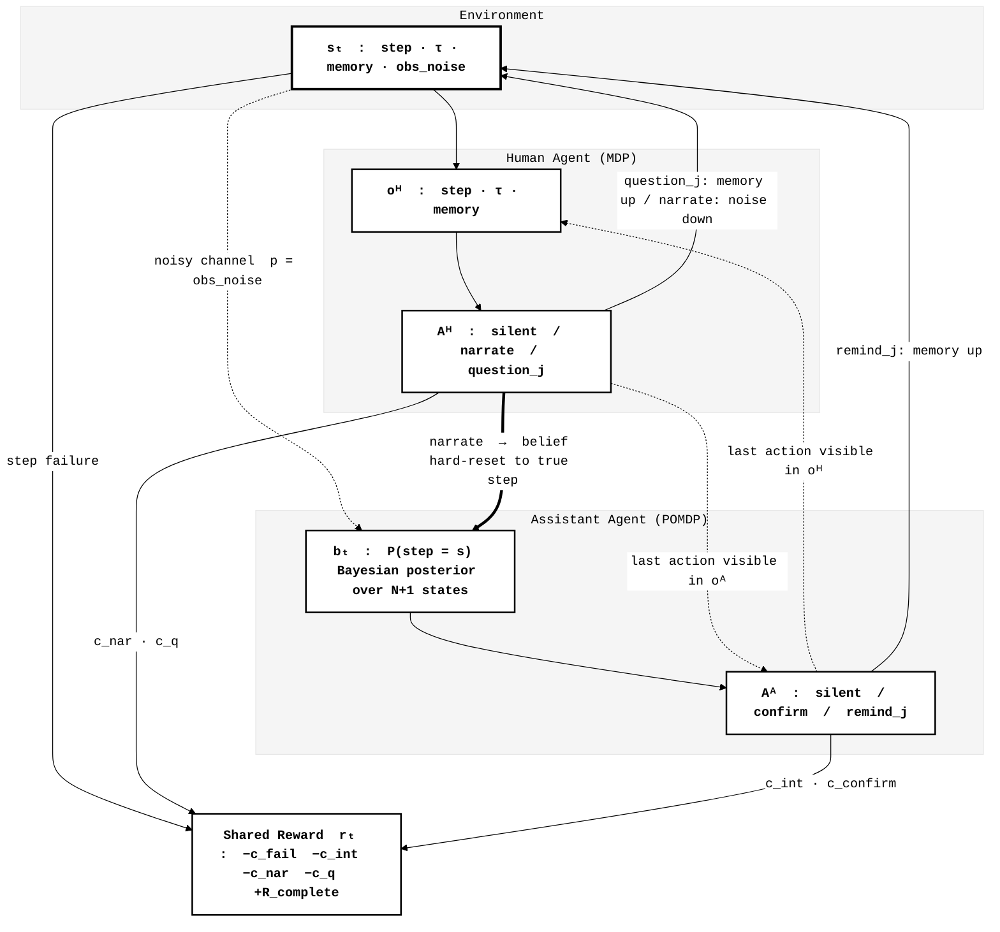
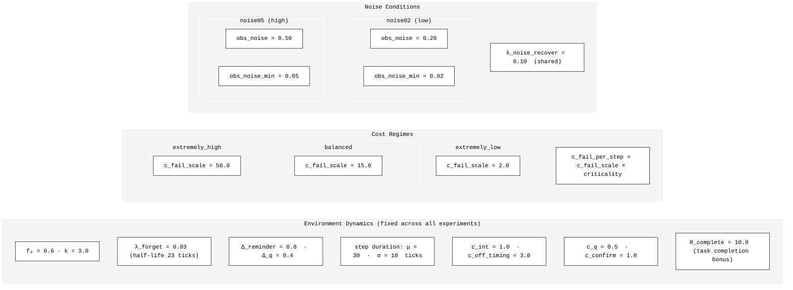
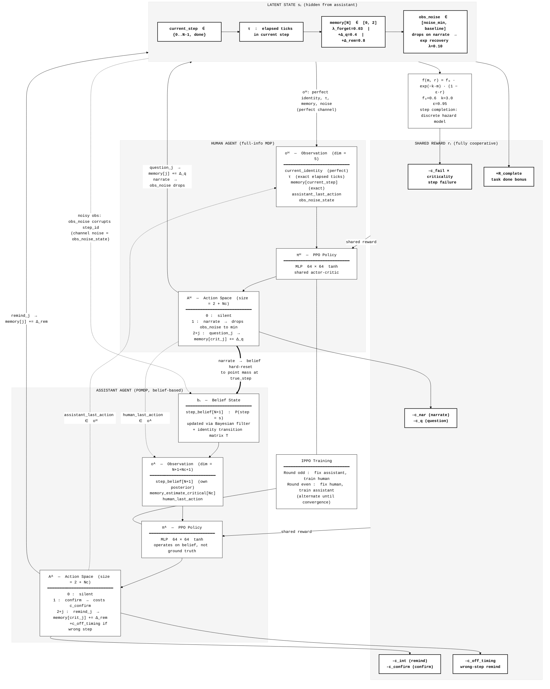
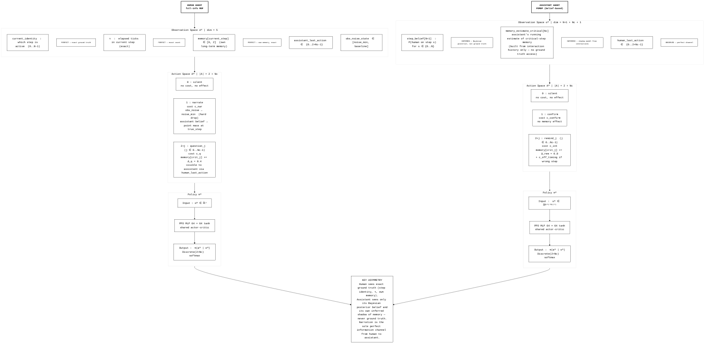
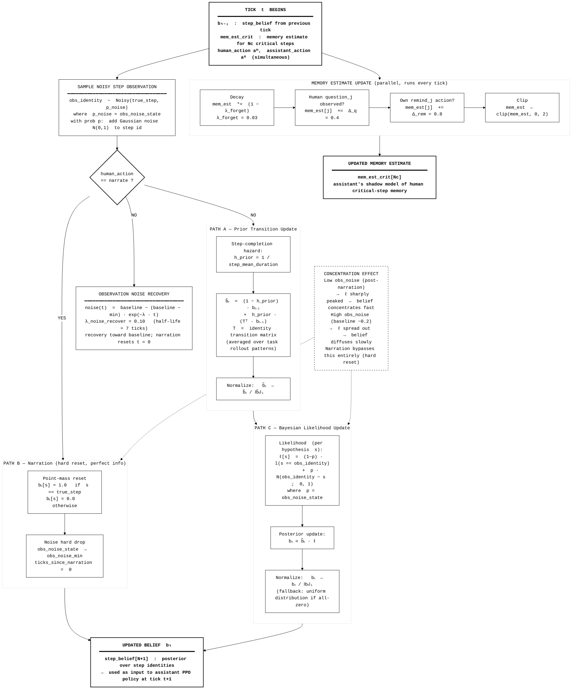
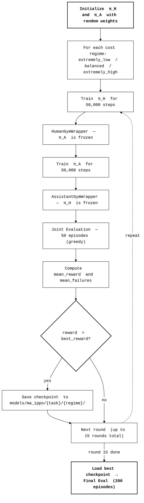
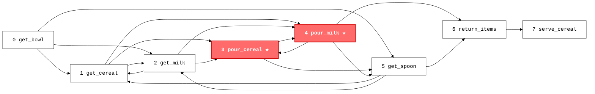
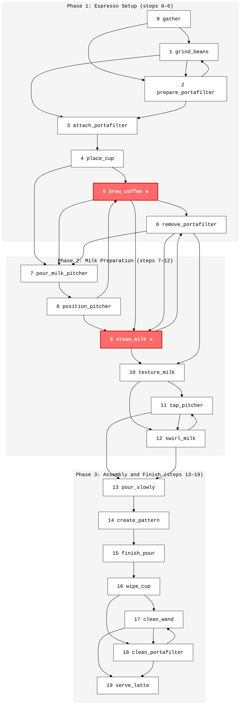

# Dec-POMDP Space Diagram: Multi-Agent Procedure Assistant

**System**: Cooperative Dec-POMDP with 2 agents (Human + Assistant)
**Task**: Sequential procedural tasks (e.g., make_cereal: N=8 steps, Nc=2 critical)
**Training**: IPPO (Independent PPO, alternating best-response)

---

## Figure 0: Dec-POMDP System Overview (Simplified)

> High-level relationships between the environment, human, and assistant.
> Focus on information asymmetry and action effects.

---

## Figure 1: Experiment Parameter Summary

> Key parameter values used across all experiments.
> Left: fixed environment dynamics. Center: cost regimes (main experimental variable). Right: noise conditions.

### Tasks Used in Experiments

| Task | Steps | Critical | base_fail_cost | Domain | Rollout Patterns |
|------|------:|--------:|---------------:|--------|:----------------:|
| make_cereal | 8 | 2 | 10.0 | cooking | 6 |
| make_coffee | 8 | 1 | 12.0 | cooking | — |
| make_tea | 9 | 2 | 12.0 | cooking | — |
| make_sandwich | 9 | 1 | 15.0 | cooking | — |
| cooking | 14 | 4 | 20.0 | cooking | — |
| make_stencil | 17 | 4 | 30.0 | crafting | — |
| latte_making | 20 | 2 | 25.0 | technical | 12 |

### PPO Hyperparameters & Training Configuration

| Hyperparameter | Value | Training Config | Standard | Noise Comparison |
|----------------|------:|----------------|--------:|----------------:|
| learning_rate | 3e-4 | n_rounds | 15 | 8 |
| n_steps (rollout) | 2048 | steps_per_round | 50,000 | 20,000 |
| batch_size | 64 | total steps/agent | 750,000 | 160,000 |
| n_epochs | 10 | eval episodes | 200 | 200 |
| gamma | 0.99 | training strategy | IPPO alternating | IPPO alternating |
| clip_range | 0.2 | | | |
| ent_coef | 0.01 | | | |

---

## Figure 1 (detailed): Dec-POMDP System Overview

> Overall architecture: hidden latent state, both agent observation/action/policy spaces,
> information flows, and shared reward decomposition.
> Dashed arrows = noisy or inferred channels. Solid arrows = perfect channels.

---

## Figure 2: Agent Space Comparison

> Side-by-side detailed view of Human vs. Assistant.
> Visual contrast between **perfect-info** observation and **belief-based / inferred** observation.

---

## Figure 3: Assistant Belief Update Mechanism

> Per-tick belief update for the assistant: three paths depending on whether the human narrates.
> Memory estimate update runs in parallel every tick.

---

## Summary Table

| | Human Agent | Assistant Agent |
|---|---|---|
| **Observability** | Full information (MDP) | Partial (POMDP) |
| **Obs space dim** | 5 | N+1+Nc+1 |
| **Key obs** | Perfect step identity, τ, own memory | Bayesian belief, inferred mem_est |
| **Action space** | {silent, narrate, question_j} | {silent, confirm, remind_j} |
| **Action size** | 2+Nc | 2+Nc |
| **Belief update** | No belief needed | Bayesian filter + transition prior |
| **Memory access** | Exact (own memory) | Shadow estimate from interactions |
| **Info channel** | narrate → resets assistant belief | — |
| **Policy** | PPO MLP 64×64 | PPO MLP 64×64 |
| **Reward** | Shared cooperative rₜ | Shared cooperative rₜ |

**Parameters** (MASimulationParams defaults):
`f₀=0.6`, `k=3.0`, `λ_forget=0.03`, `Δ_reminder=0.8`, `Δ_q=0.4`, `λ_noise_recover=0.10`

---

## Figure 4: IPPO Training Procedure

> Alternating best-response loop used to train both agents jointly.
> One "round" = train human (assistant fixed) + train assistant (human fixed) + joint eval.
> 15 rounds × 3 cost regimes per task.

### PPO Configuration (both agents, shared)

| lr | n_steps | batch_size | n_epochs | γ | λ (GAE) | clip | ent_coef |
|----|---------|-----------|---------|---|---------|------|---------|
| 3e-4 | 2048 | 64 | 10 | 0.99 | 0.95 | 0.2 | 0.01 |

Policy network: MLP 64 × 64, tanh activation, shared actor-critic.

---

## Figure 5: Task Step Graphs

### make_cereal  (8 steps, 2 critical)

> Critical steps (★) colored red. Arrows show all possible step-to-step transitions across all 6 rollout patterns (18 unique edges).

---

### latte_making  (20 steps, 2 critical)

> Critical steps (★) colored red. Steps grouped into 3 phases. Arrows show all possible step-to-step transitions across all 12 rollout patterns (37 unique edges), including cross-phase and back-edges.

---

## Figure 6: Experiment Results

### make_cereal Results

| Regime | c_fail_scale | Best Baseline | MA-IPPO Final | Failure Rate | Learned Strategy |
|--------|-------------|:-------------:|:-------------:|:------------:|-----------------|
| extremely_low | 2.0 | 7.57 (silent) | **7.08** | 0.74 | Strategic silence (questions = 0) |
| balanced | 15.0 | -7.33 (silent) | **3.84** | 0.15 | Selective questions (≈6/episode) |
| extremely_high | 50.0 | -52.25 (silent) | **-1.49** | 0.16 | Active questions (≈6/episode) |

> Baseline: `both_silent` (human and assistant both always silent).
> Failures reduced 8× in balanced, 78× improvement vs baseline in extremely_high.

### latte_making Results

| Regime | c_fail_scale | Best Baseline | MA-IPPO Final | Failure Rate | Learned Strategy |
|--------|-------------|:-------------:|:-------------:|:------------:|-----------------|
| extremely_low | 2.0 | 7.45 (silent) | -1.47 | 0.24 | Strategic silence (questions ≈ 0) |
| balanced | 15.0 | -7.47 (silent) | -16.03 | 0.77 | Mostly silent (questions ≈ 0.1) |
| extremely_high | 50.0 | -49.25 (silent) | -48.25 | 1.17 | Silent — convergence difficulty |

> latte_making is significantly harder (20 steps vs 8). The agent struggles especially in
> balanced/extremely_high regimes. Failure rate remains high due to task complexity.

### Regime × Task Summary

| | make_cereal | latte_making |
|---|---|---|
| **Best regime for learning** | extremely_high (+97% vs baseline) | extremely_low (best relative) |
| **Strategy: extremely_low** | Strategic silence | Strategic silence |
| **Strategy: balanced** | Selective questions | Mostly silent |
| **Strategy: extremely_high** | Active questioning | Convergence difficulty |
| **Narrations learned** | 0 across all regimes | 0 across all regimes |
