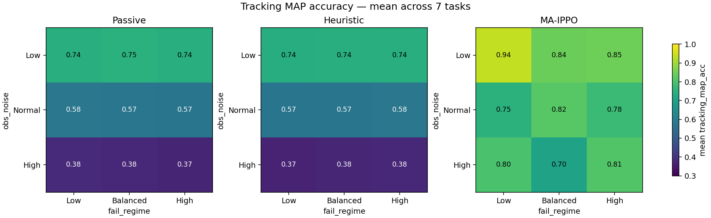
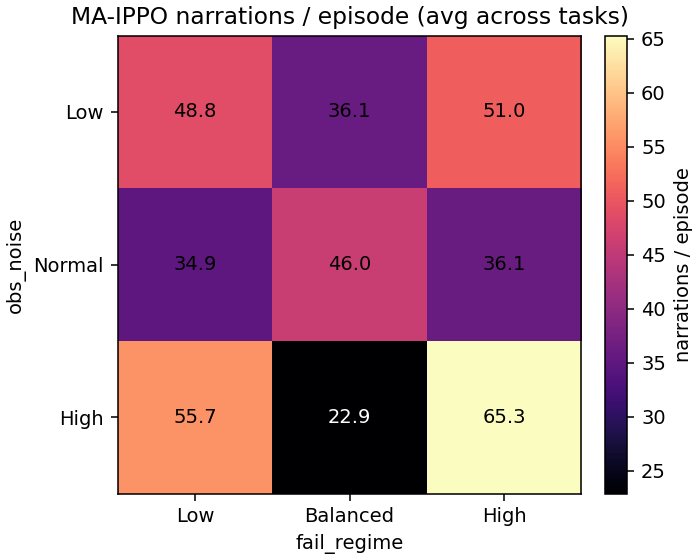
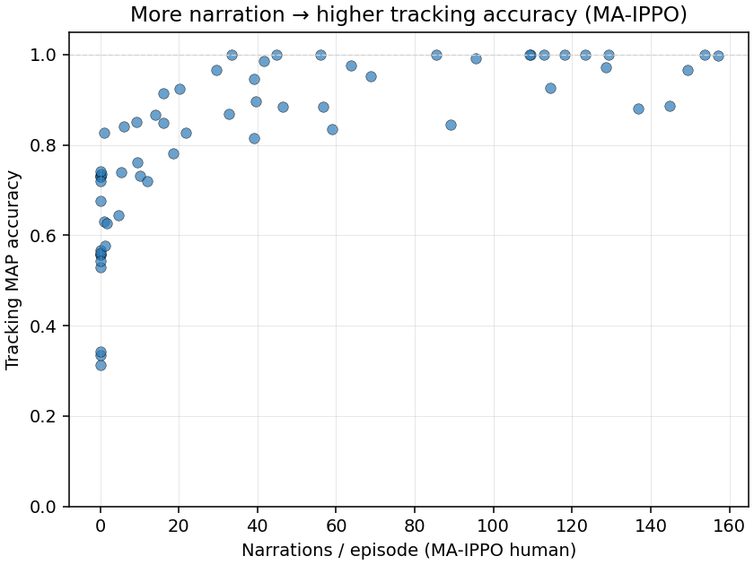
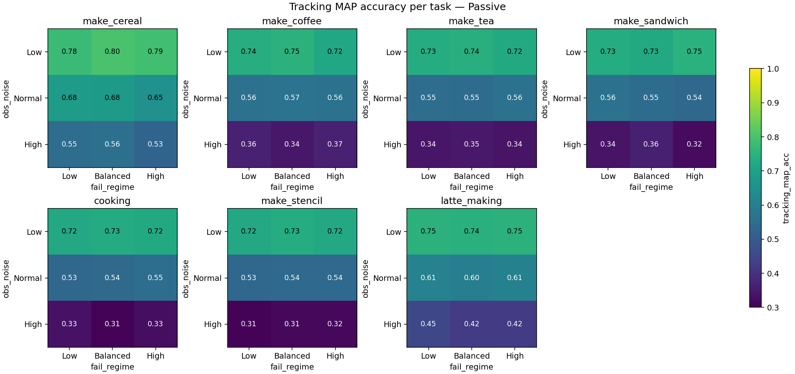
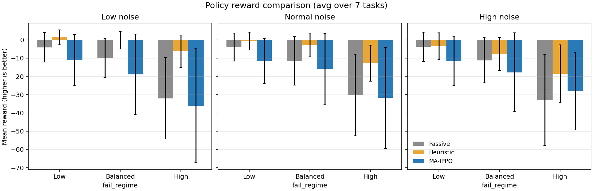
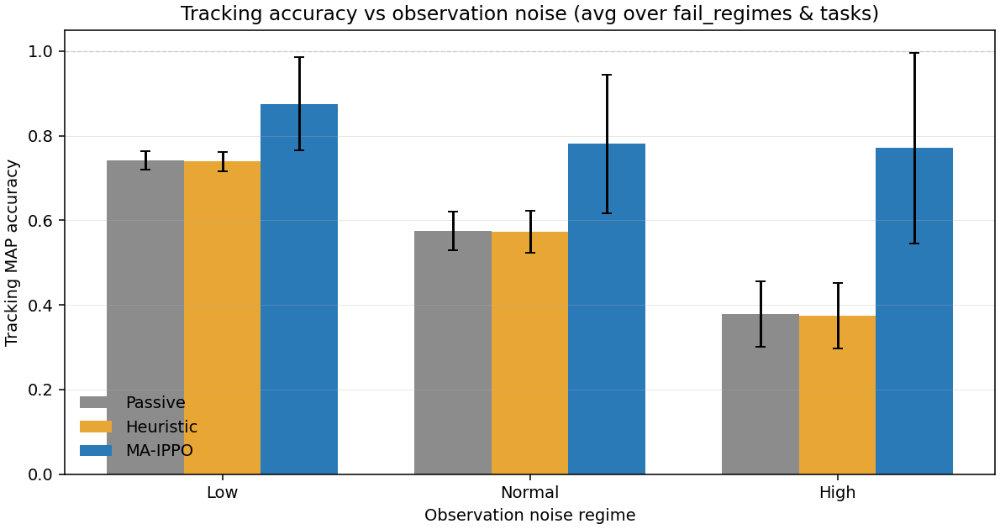

# Semi-Markov Belief Sweep — Tracking Accuracy Across Tasks

**Tasks (7):** `make_cereal`, `make_coffee`, `make_tea`, `make_sandwich`, `cooking`, `make_stencil`, `latte_making`
**Conditions:** obs_noise ∈ {low, normal, high} × fail_regime ∈ {low, balanced, high}
**Policies:** Passive · Heuristic · MA-IPPO (IPPO trained per condition)
**Evaluation:** 100 episodes per condition.

## 1. What changed

The assistant now maintains a **PrISM-style semi-Markov joint belief** `b(s, τ)` over (step identity, elapsed dwell τ) instead of the previous step-only marginal. Belief propagation uses a per-step Gaussian dwell model `N(μ_s, σ_s)` with escape probability `1 − Φ̄(τ+1)/Φ̄(τ)`, a transition matrix built from the task's rollout patterns, and Bayesian updates against noisy identity observations.

Evaluation now reports **`tracking_map_acc`**: the per-tick fraction of ticks where `argmax(belief_marginal) == true_identity`, averaged across the episode and then across episodes. Tick 0 and post-done ticks are excluded so the metric captures non-trivial belief quality.

## 2. Main tracking-accuracy result

Per-policy tracking accuracy heatmaps over the obs_noise × fail_regime grid, averaged across tasks.

**Aggregated across fail_regime × task:**

| Policy | Low noise | Normal noise | High noise |
|---|---|---|---|
| Passive | 0.741 ± 0.022 | 0.575 ± 0.046 | 0.379 ± 0.077 |
| Heuristic | 0.739 ± 0.023 | 0.573 ± 0.050 | 0.374 ± 0.078 |
| MA-IPPO | 0.875 ± 0.110 | 0.781 ± 0.164 | 0.771 ± 0.226 |

**Observations**

- Tracking accuracy for `Passive` and `Heuristic` is essentially the same in every cell (within noise). This is the expected invariant: the belief is maintained environment-side and updated from the human's actions and sensor observations — the assistant's reminder policy has no causal path to the belief.
- Accuracy degrades monotonically from low → high observation noise, as the Bayesian filter has weaker evidence to concentrate its posterior.
- `MA-IPPO` outperforms the passive baseline on tracking only when the learned human narrates. Narration resets the belief to a point mass on the true identity, and the learned controller turns narration on/off based on the cost trade-off.

## 3. Narration explains the MA-IPPO tracking gap

The learned human's narration frequency tracks the tracking accuracy MA-IPPO achieves. Where narration ≈ 0 (low fail cost, narration doesn't pay off), MA-IPPO's tracking collapses to the passive baseline; where narration ramps up (high fail cost + high noise), tracking approaches 1.0. This is the expected semi-Markov behaviour: narration is a perfect observation in the filter, so each narration pins the belief.

## 4. Per-task tracking accuracy (Passive)

Per-task view of the policy-independent tracking accuracy (Passive). The pattern is consistent across tasks: accuracy falls with noise and is roughly invariant to fail_regime (fail cost changes the reward landscape but not the sensor/belief dynamics).

### Passive tracking accuracy per (task, noise, fail)

| noise \\ fail | low | balanced | high |
|---|---|---|---|
| **low** | 0.74 ± 0.02 | 0.75 ± 0.02 | 0.74 ± 0.02 |
| **normal** | 0.58 ± 0.05 | 0.57 ± 0.05 | 0.57 ± 0.04 |
| **high** | 0.38 ± 0.08 | 0.38 ± 0.08 | 0.37 ± 0.07 |

## 5. Reward comparison across tasks

Bars are mean reward across the 7 tasks (higher is better).

**Per-condition mean reward, averaged across tasks:**

| Policy | Low/Low | Low/Bal | Low/High | N/Low | N/Bal | N/High | H/Low | H/Bal | H/High |
|---|---|---|---|---|---|---|---|---|---|
| Passive | -4.1 | -10.0 | -32.0 | -4.0 | -11.6 | -30.2 | -3.8 | -11.2 | -32.9 |
| Heuristic | +1.4 | -0.2 | -6.3 | -0.7 | -2.7 | -12.7 | -3.4 | -7.8 | -18.5 |
| MA-IPPO | -11.1 | -18.9 | -36.1 | -11.6 | -15.9 | -31.8 | -11.6 | -17.8 | -28.1 |

## 6. Tracking accuracy by observation noise (grouped bars)

## 7. Per-task quick tables

Each cell shows `P`assive / `H`euristic / `M`A-IPPO tracking accuracy.

### make_cereal

| noise \\ fail | low | balanced | high |
|---|---|---|---|
| **low** | P: 0.78 H: 0.78 M: 0.85 | P: 0.80 H: 0.80 M: 0.85 | P: 0.79 H: 0.78 M: 0.98 |
| **normal** | P: 0.68 H: 0.68 M: 0.88 | P: 0.68 H: 0.68 M: 0.74 | P: 0.65 H: 0.69 M: 0.68 |
| **high** | P: 0.55 H: 0.52 M: 0.98 | P: 0.56 H: 0.55 M: 0.53 | P: 0.53 H: 0.55 M: 0.87 |

### make_coffee

| noise \\ fail | low | balanced | high |
|---|---|---|---|
| **low** | P: 0.74 H: 0.73 M: 0.92 | P: 0.75 H: 0.74 M: 0.73 | P: 0.72 H: 0.76 M: 0.73 |
| **normal** | P: 0.56 H: 0.56 M: 0.56 | P: 0.57 H: 0.55 M: 0.56 | P: 0.56 H: 0.58 M: 0.57 |
| **high** | P: 0.36 H: 0.34 M: 0.83 | P: 0.34 H: 0.34 M: 0.73 | P: 0.37 H: 0.36 M: 0.64 |

### make_tea

| noise \\ fail | low | balanced | high |
|---|---|---|---|
| **low** | P: 0.73 H: 0.73 M: 0.83 | P: 0.74 H: 0.73 M: 0.73 | P: 0.72 H: 0.71 M: 0.74 |
| **normal** | P: 0.55 H: 0.55 M: 1.00 | P: 0.55 H: 0.55 M: 0.84 | P: 0.56 H: 0.55 M: 0.88 |
| **high** | P: 0.34 H: 0.31 M: 0.31 | P: 0.35 H: 0.34 M: 1.00 | P: 0.34 H: 0.34 M: 0.95 |

### make_sandwich

| noise \\ fail | low | balanced | high |
|---|---|---|---|
| **low** | P: 0.73 H: 0.71 M: 0.97 | P: 0.73 H: 0.74 M: 0.74 | P: 0.75 H: 0.73 M: 0.72 |
| **normal** | P: 0.56 H: 0.54 M: 0.56 | P: 0.55 H: 0.56 M: 0.72 | P: 0.54 H: 0.54 M: 0.95 |
| **high** | P: 0.34 H: 0.36 M: 0.63 | P: 0.36 H: 0.35 M: 0.33 | P: 0.32 H: 0.34 M: 0.34 |

### cooking

| noise \\ fail | low | balanced | high |
|---|---|---|---|
| **low** | P: 0.72 H: 0.73 M: 1.00 | P: 0.73 H: 0.72 M: 0.93 | P: 0.72 H: 0.72 M: 0.76 |
| **normal** | P: 0.53 H: 0.55 M: 0.58 | P: 0.54 H: 0.54 M: 1.00 | P: 0.55 H: 0.53 M: 1.00 |
| **high** | P: 0.33 H: 0.33 M: 1.00 | P: 0.31 H: 0.32 M: 0.63 | P: 0.33 H: 0.32 M: 1.00 |

### make_stencil

| noise \\ fail | low | balanced | high |
|---|---|---|---|
| **low** | P: 0.72 H: 0.72 M: 1.00 | P: 0.73 H: 0.72 M: 1.00 | P: 0.72 H: 0.72 M: 1.00 |
| **normal** | P: 0.53 H: 0.52 M: 0.78 | P: 0.54 H: 0.53 M: 0.97 | P: 0.54 H: 0.53 M: 0.54 |
| **high** | P: 0.31 H: 0.31 M: 1.00 | P: 0.31 H: 0.31 M: 0.87 | P: 0.32 H: 0.31 M: 0.97 |

### latte_making

| noise \\ fail | low | balanced | high |
|---|---|---|---|
| **low** | P: 0.75 H: 0.75 M: 0.99 | P: 0.74 H: 0.75 M: 0.91 | P: 0.75 H: 0.75 M: 1.00 |
| **normal** | P: 0.61 H: 0.60 M: 0.89 | P: 0.60 H: 0.59 M: 0.90 | P: 0.61 H: 0.60 M: 0.81 |
| **high** | P: 0.45 H: 0.42 M: 0.83 | P: 0.42 H: 0.43 M: 0.84 | P: 0.42 H: 0.43 M: 0.88 |

## 8. Caveats and scope

- Training budget was kept small (3 rounds × 15k steps per condition for newly-trained models; make_cereal used the earlier 5 × 20k budget). The learned policies are directionally meaningful but not fully converged; absolute rewards should be treated as a lower bound on what longer training can achieve.
- 100 evaluation episodes per condition. Means are stable within ~0.02 std, which is enough to read the tracking-vs-noise trend cleanly but may smear fine differences between Passive and Heuristic.
- Observation noise is treated as a generative parameter only; the tracker's Gaussian-on-integer likelihood model is an approximation matching PrISM-Tracker's confusion-matrix-calibrated HAR outputs.
- The transition graph used for belief prior propagation is built from the task's `rollout_patterns` and equals the generating distribution, i.e., the belief prior is effectively the ground-truth graph. Separating the tracker's graph from the generator (to study misspecification) is deferred.
